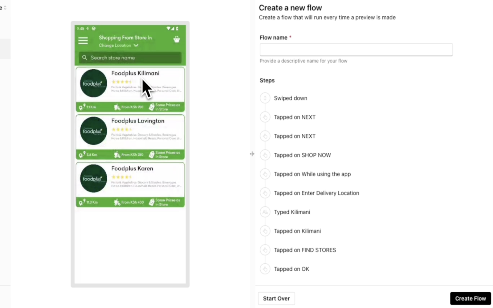
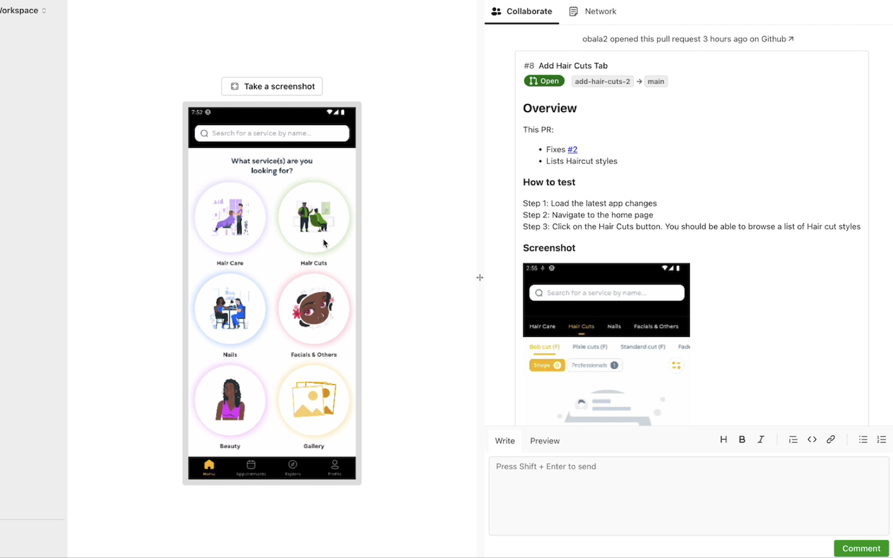

Quill is designed to help mobile app teams automate their UI testing with no-code tooling. This ensures your app is
free of defects before it gets in the hands of users. It also enables them to review mobile app changes effortlessly.
By providing an online emulator with real-time feedback features, Quill eliminates the need for sharing mobile app files
or manually setting up local environments.

#### No-Code UI tests

#### Mobile Previews

### Key Features

- Preview mobile app PRs directly on the web.
- Capture and annotate screenshots from the emulator.
- Provide feedback and integrate with Slack.
- Track issues with JIRA (coming soon).
- Network logs to monitor API interactions during reviews.
