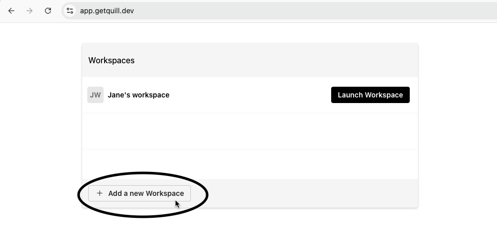
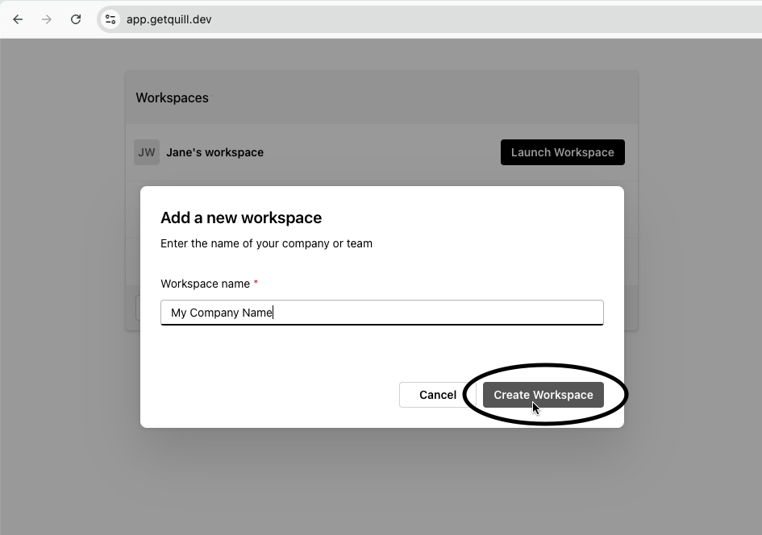

Upon signing in, a default workspace will be created for you. You may opt to create a new workspace for
your team or organization.

## Create a workspace.

Workspaces allow you to organize repositories and invite your team members.
Steps to create a workspace

1. Navigate to [app.getquill.dev](https://app.getquill.dev)
2. Click on the "Add a new Workspace" button
   
3. Give your workspace a name
4. Click on the "Create Workspace" button. This will redirect you to a GitHub page
   
