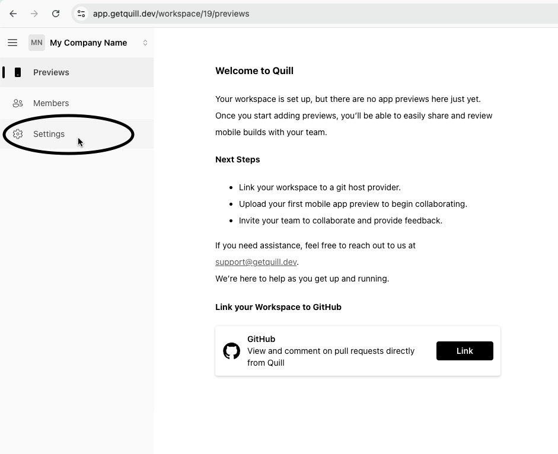
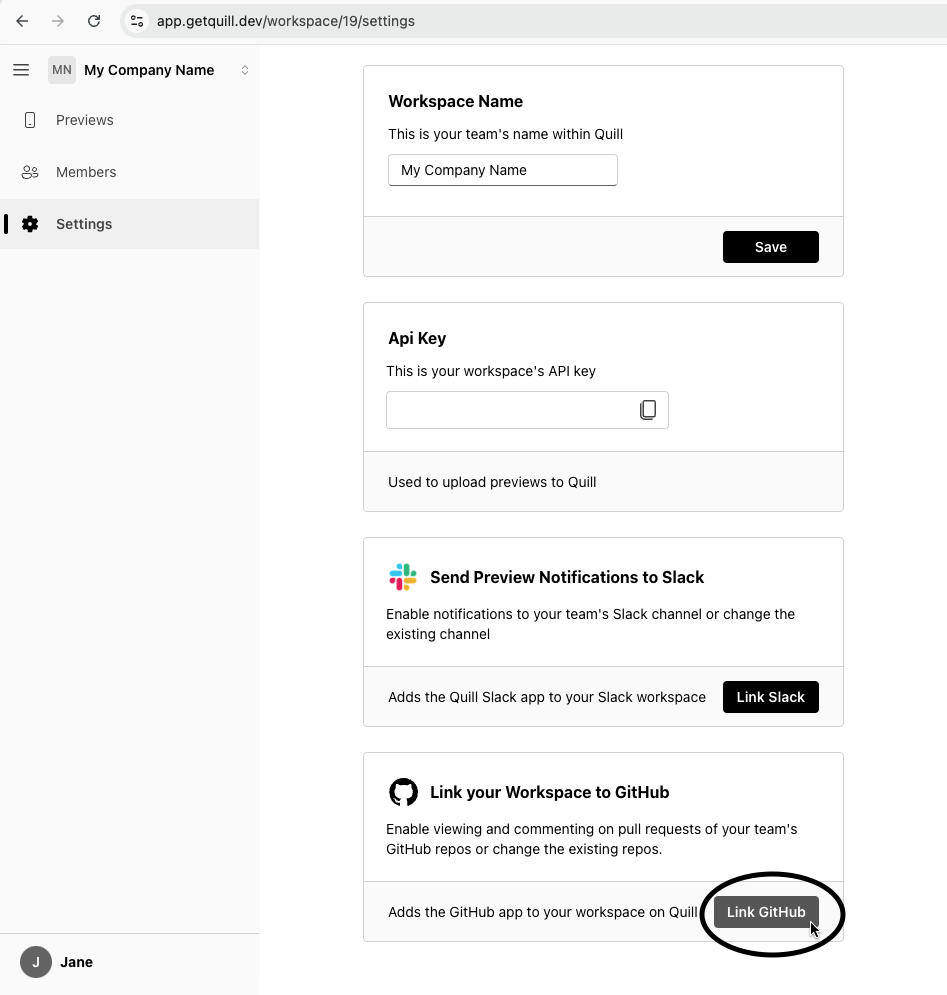
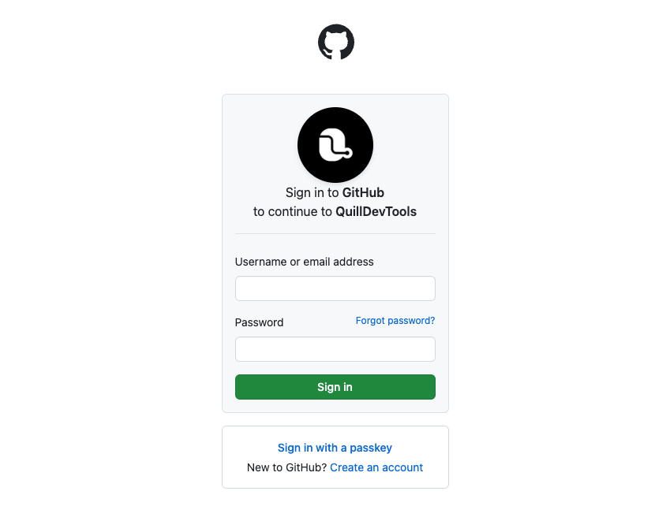
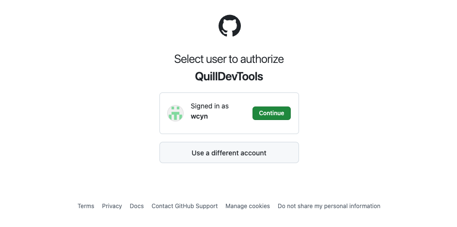
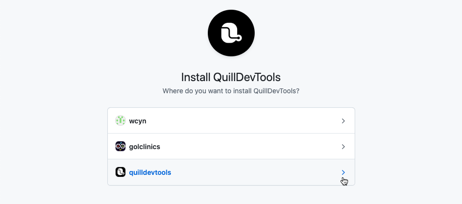
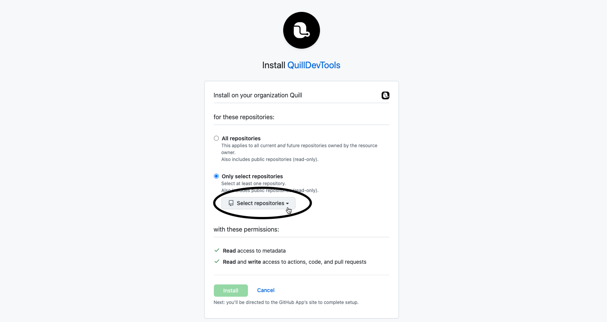

### Connecting to GitHub

1. Navigate to the _Settings_ page
   
2. In the settings tab, scroll to the "Link your Workspace to GitHub" section and click on the "Link GitHub" button.
   
3. Sign in with your GitHub account if not already done so.
   
4. Select the user with access to the project you'd like to link to Quill
   
5. Select the user or organization you want to install QuillDevTools in.
   If QuillDevTools is already installed in your organization or user, you can click "Configure"
   
6. Select the repository you'd like to link to Quill and click the "Install" button.
   This will redirect you back to the Quill website.
   

### Managing Multiple Git Hosts (coming soon)

Quill will soon support multiple Git host providers including GitLab, BitBucket and Azure Dev Ops. Stay tuned!
