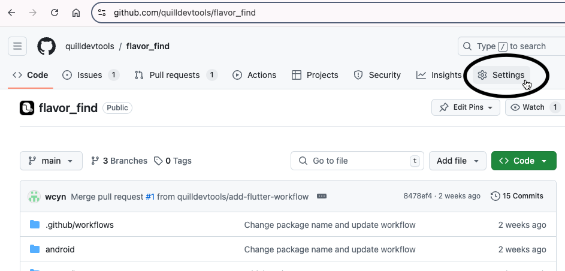
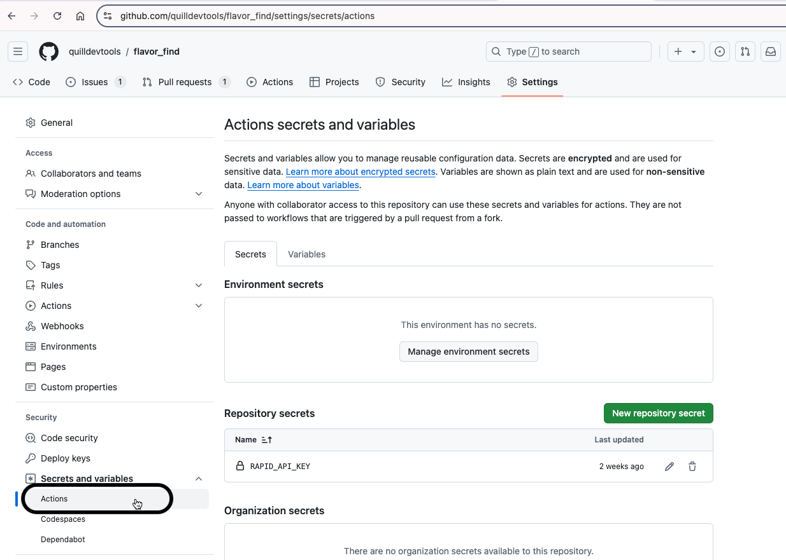

To create a mobile app Preview, you need to add [Quill Previews GitHub Action](https://github.com/quilldevtools/preview)
to your repository’s GitHub workflow file. This will automate the generation of PR previews. Follow these steps:

### 1. Add the API key of your Quill workspace to your GitHub Secrets

In order to upload mobile app file to Quill, you will need an API key. To get your API key:

1. Navigate to the settings page of the workspace you'd like to post previews to
2. Locate the "Api Key" section
3. Click the copy icon beside the API key to copy it
   
4. Go to your repository on GitHub and click on "Settings" at the top of the page
   
5. Under "Secrets and Variables", click on "Actions"
   
6. Click on the "New Repository Secret" button
   
7. Name your secret `QUILL_API_KEY`. Paste the API key from your Quill workspace in the "Secret" text box then click
   the "Add Secret" button
   

### 2. Create a Workflow File

Create a file `.github/workflows/android-build.yml` and add the following code depending on the type of Android
application you are building:

- [Native Android Application](#native-android-application)
- [Flutter Application](#flutter-application)
- [React Native Application](#react-native-application)

This workflow will run whenever a pull request is made. Remember to replace "com.example"
with your app's actual package name

#### Native Android Application

```yaml
name: Build Android Application
# Controls when the workflow will run. It is recommended to run it when a pull request is
# opened and when the pull request code is updated (synchronized)
on:
  # This will enable the creation of no-code UI tests for your mobile app.
  # Tests are created against the latest app on the main branch
  push:
    branches:
      - "main" # Change to the name of your main branch as needed

  # This gives you mobile app previews for your pending Pull Request changes
  pull_request:
    types: [opened, synchronize]
    branches:
      - "main" # Change to the name of your main branch as needed

permissions:
  pull-requests: write # Needed to add comments to the Pull Request that triggered the build
  actions: write # Needed to cancel a workflow when it no longer needs to run
  contents: read # So GitHub can checkout the code and build the app

# A workflow run is made up of one or more jobs that can run sequentially or in parallel
jobs:
  # This workflow contains a single job called "build"
  build:
    name: Build Android App
    runs-on: ubuntu-latest

    steps:
      # Checkout code
      - name: Checkout code
        uses: actions/checkout@v3

      # Set up Java. Change this according to the JDK version needed
      - name: Set up JDK 11
        uses: actions/setup-java@v3
        with:
          java-version: "11"
          distribution: "adopt"

      # Cache Gradle dependencies
      - name: Cache Gradle files
        uses: actions/cache@v3
        with:
          path: ~/.gradle/caches
          key: ${{ runner.os }}-gradle-${{ hashFiles('**/*.gradle*', '**/gradle-wrapper.properties') }}
          restore-keys: |
            ${{ runner.os }}-gradle-

      # Set up Android SDK. Change this according to the version needed
      - name: Set up Android SDK
        uses: android-actions/setup-android@v2
        with:
          api-level: 33
          build-tools: 33.0.0
          cmake-version: 3.22.1
          ndk-version: 21.4.7075529

      # Build the application
      - name: Build APK
        run: ./gradlew assembleDebug

      # Create a preview on Quill
      - uses: quilldevtools/preview@main
        with:
          app-path: "app/build/outputs/apk/debug/app-debug.apk"
          pkg-name: "com.example" # REPLACE THIS WITH THE NAME OF YOUR APP PACKAGE
          api-key: ${{secrets.QUILL_API_KEY}}
```

#### Flutter Application

```yaml
name: Build Android Application
# Controls when the workflow will run. It is recommended to run it when a pull request is
# opened and when the pull request code is updated (synchronized)
on:
  # This will enable the creation of no-code UI tests for your mobile app.
  # Tests are created against the latest app on the main branch
  push:
    branches:
      - "main" # Change to the name of your main branch as needed

  # This gives you mobile app previews for your pending Pull Request changes
  pull_request:
    types: [opened, synchronize]
    branches:
      - "main"

permissions:
  pull-requests: write # Needed to add comments to the Pull Request that triggered the build
  actions: write # Needed to cancel a workflow when it no longer needs to run
  contents: read # Needed so that GitHub can pull the code and build the app

# A workflow run is made up of one or more jobs that can run sequentially or in parallel
jobs:
  # This workflow contains a single job called "build"
  build:
    name: Build Android App
    runs-on: ubuntu-latest

    steps:
      - uses: actions/checkout@v2
      - uses: actions/setup-java@v1
        with:
          java-version: "11.0"
      - uses: subosito/flutter-action@v1
        with:
          flutter-version: "3.19.2"

      # Fetch Dependencies
      - run: flutter pub get

      # Builf Android App
      - run: flutter build apk --release

      # Create a preview on Quill
      - uses: quilldevtools/preview@main
        with:
          app-path: "build/app/outputs/flutter-apk/app-release.apk"
          pkg-name: "com.example" # REPLACE THIS WITH THE NAME OF YOUR APP PACKAGE
          api-key: ${{secrets.QUILL_API_KEY}}
```

#### React Native Application

```yaml
name: Build Android Application
# Controls when the workflow will run. It is recommended to run it when a pull request is
# opened and when the pull request code is updated (synchronized)
on:
  # This will enable the creation of no-code UI tests for your mobile app.
  # Tests are created against the latest app on the main branch
  push:
    branches:
      - "main" # Change to the name of your main branch as needed

  # This gives you mobile app previews for your pending Pull Request changes
  pull_request:
    types: [opened, synchronize]
    branches:
      - "main"

permissions:
  pull-requests: write # Needed to add comments to the Pull Request that triggered the build
  actions: write # Needed to cancel a workflow when it no longer needs to run
  contents: read # So GitHub can checkout the code and build the app

# A workflow run is made up of one or more jobs that can run sequentially or in parallel
jobs:
  # This workflow contains a single job called "build"
  build:
    name: Build Android App
    runs-on: ubuntu-latest

    steps:
      # Checkout code
      - name: Checkout code
        uses: actions/checkout@v3

      # Set up Node.js
      - name: Set up Node.js
        uses: actions/setup-node@v3
        with:
          node-version: "18"

      # Cache Node.js dependencies
      - name: Cache node_modules
        uses: actions/cache@v3
        with:
          path: |
            node_modules
            android/.gradle
          key: ${{ runner.os }}-node-modules-${{ hashFiles('**/package-lock.json', '**/yarn.lock') }}
          restore-keys: |
            ${{ runner.os }}-node-modules-

      # Install Node.js dependencies
      - name: Install dependencies
        run: yarn install

      # Set up Java
      - name: Set up JDK 11
        uses: actions/setup-java@v3
        with:
          java-version: "11"
          distribution: "adopt"

      # Set up Android SDK
      - name: Set up Android SDK
        uses: android-actions/setup-android@v2
        with:
          api-level: 33
          build-tools: 33.0.0

      # Build the React Native Android app
      - name: Build APK
        run: cd android && ./gradlew assembleRelease

      # Create a preview on Quill
      - uses: quilldevtools/preview@main
        with:
          app-path: "android/app/build/outputs/apk/release/app-release.apk"
          pkg-name: "com.example" # REPLACE THIS WITH THE NAME OF YOUR APP PACKAGE
          api-key: ${{secrets.QUILL_API_KEY}}
```

### 3. Create a Pull Request with the new workflow file

Once you create the new workflow file, create a new Pull request with that change. You should see a GitHub action
running a few seconds after the Pull Request is created. You can click on "Details" to monitor the run. If you encounter
any build failures, feel free to chat with us on our Slack channel here:
https://join.slack.com/t/quillchat/shared_invite/zt-2ush8qc0l-fx3EKLnXIYFldoNpt61WbQ


That's it! You're now set up with Quill. You can also [link your Quill workspace to Slack](/integrating-slack)
